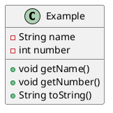
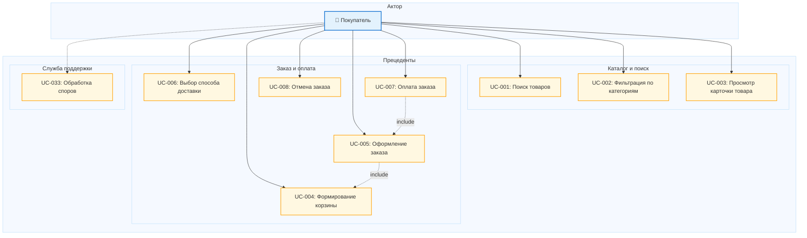

```plantuml
@startuml
  class Example {
    - String name
    - int number 
    
    +void getName()
    +void getNumber()
    +String toString()
  }
@enduml
```

```mermaid
flowchart TB
    subgraph Actors["Актор"]
        A1["👤 Покупатель"]
    end
    
    subgraph UC["Прецеденты"]
        subgraph C1["Каталог и поиск"]
            UC001["UC-001: Поиск товаров"]
            UC002["UC-002: Фильтрация по категориям"]
            UC003["UC-003: Просмотр карточки товара"]
        end
        
        subgraph C2["Заказ и оплата"]
            UC004["UC-004: Формирование корзины"]
            UC005["UC-005: Оформление заказа"]
            UC006["UC-006: Выбор способа доставки"]
            UC007["UC-007: Оплата заказа"]
            UC008["UC-008: Отмена заказа"]
        end
        
        subgraph C3["Служба поддержки"]
            UC033["UC-033: Обработка споров"]
        end
    end
    
    A1 --> UC001
    A1 --> UC002
    A1 --> UC003
    A1 --> UC004
    A1 --> UC005
    A1 --> UC006
    A1 --> UC007
    A1 --> UC008
    A1 -.-> UC033
    
    UC005 -.include.-> UC004
    UC007 -.include.-> UC005
    
    classDef actor fill:#e3f2fd,stroke:#1976d2,stroke-width:2px
    classDef group fill:#f5f9ff,stroke:#bbdefb
    classDef usecase fill:#fff8e1,stroke:#ffa000,stroke-width:1.5px
    
    class Actors,UC,C1,C2,C3 group
    class A1 actor
    class UC001,UC002,UC003,UC004,UC005,UC006,UC007,UC008,UC033 usecase
```
