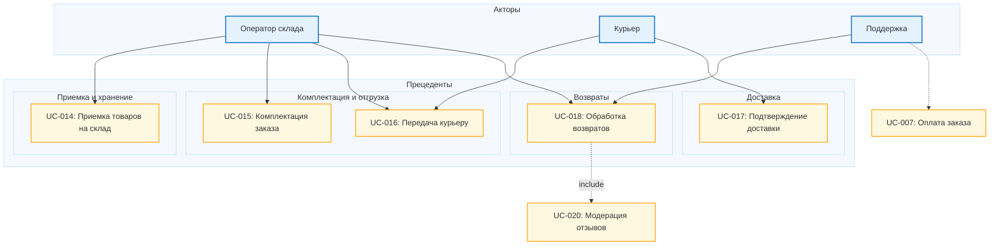

## Диаграмма Логистики

[Возврат в Список диаграмм](https://github.com/nnd2023/marketplace-project/blob/main/%D0%94%D0%B8%D0%B0%D0%B3%D1%80%D0%B0%D0%BC%D0%BC%D1%8B%20%D0%BF%D1%80%D0%B5%D1%86%D0%B5%D0%BD%D0%B4%D0%B5%D0%BD%D1%82%D0%BE%D0%B2/%D0%A1%D0%BF%D0%B8%D1%81%D0%BE%D0%BA%20%D0%B4%D0%B8%D0%B0%D0%B3%D1%80%D0%B0%D0%BC.md)
